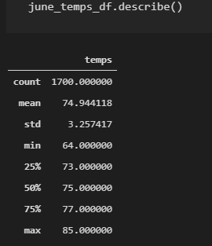
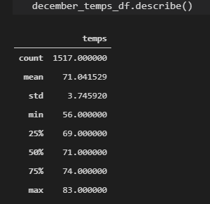
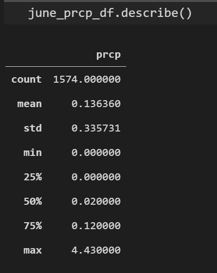
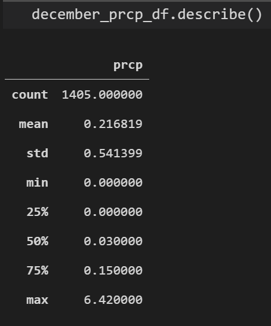

# Surfs_Up

#

# Overview 
The purpose of this analysis was to retrieve temperature data for the months of June and December gathered over the last 8 years. The information is required for a business plan for a surf and ice cream shop in Oahu, Hawaii. This data would help determine if the location would be successful for the business.

# Results

- The average temperature for June is 74 degrees fahrenheit 
- The average temperature for December is 71 degrees fahrenheit  
- The standard deviation for the month of June is 3.25 degrees fahrenheit
- The standard deviation for the month of December is 3.74 degrees fahrenheit

   Below is a statistic summary for temperature for June:

   
   

     
   Below is a statistic summary for temperature for December:

   

   

# Summary
In summary, the data for the average temperatures of June and December are between 71 and 75 degrees fahrenheit. The standard deviation is low for both months showing 3.25 degrees fahrenheit for June and 3.74 degrees fahrenheit for December. Therefore, the temperature data indicates good weather for months requested for this analysis. To affirm this conclusion, two statistic summary queries were performed for percipitation for the months of June and December. The summary indicates 50% for the month of June's percipitaion is .02 inches and .03 inches for 50% for the month of December.  Images provided below:

  
   

   

   